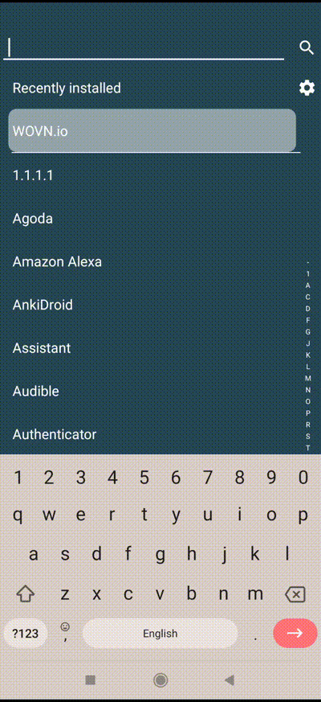

# WOVN Settings Screen in the App Info

The `WOVN Settings Screen` feature provides a pre-configured interface that allows users to manage the app's translation settings. This feature is designed to:

- Enable non-technical team members to easily toggle debug mode for faster reporting and re-translations. When used with `Limit reporting to only app operator`, it ensures user privacy.
- Offer a straightforward way to view debugging information, such as reporting status, user ID, and other relevant details for troubleshooting.

## Setup Instructions

To integrate the WOVN Settings screen into your app, add the following code to your `AndroidManifest.xml` file. This configuration adds the pre-configured WOVN Settings screen to the App Info section of your app.

```xml
<activity
    android:name="io.wovn.wovnapp.debugmode.WovnSettingsActivity"
    android:label="Translation Settings"
    android:exported="true">
    <intent-filter>
        <action android:name="android.intent.action.APPLICATION_PREFERENCES" />
        <category android:name="android.intent.category.DEFAULT" />
    </intent-filter>
</activity>
```

## Demonstration

You can preview the functionality of the WOVN Settings screen in this video:



## NOTE

1. Users must enter the correct token in the `Validation Token` field to modify settings. This ensures that only authorized users can make changes.
