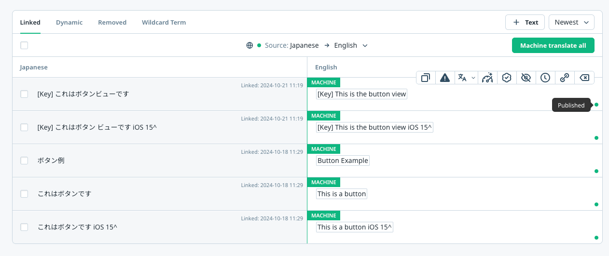
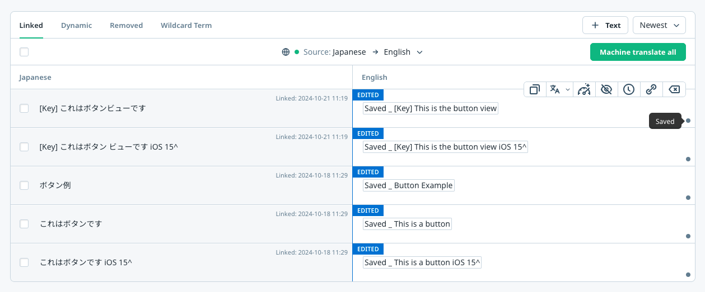

# Preview translation feature

Preview translation feature allows `app operators` to preview the translated version of the app without publishing the changes. This feature is useful for checking the translation quality and layout of the translated app before publishing the changes.

## How it works

When the preview translation feature is enabled, the SDK will show `published` translations to all end users, but show `saved` translations to the app operators.

- End users will see the published translations. This is when you click the `Save and Publish` button in the Wovn Dashboard. 
- App operators will see the saved translations. This is when you click the `Save` button in the Wovn Dashboard. 

## How to enable preview translation

1. Enable debug mode for the test devices: [Debug Mode Document](./debug_mode.md)
2. Enable the preview translation feature by adding `translation_preview_mode=true` to the `wovn.properties` file.

    ```properties
    token=YOUR_WOVN_PROJECT_TOKEN
    translation_preview_mode=true
    ```

3. Save the `wovn.properties` file and restart the app.

Now the devices with debug mode enabled will show the saved translations, and the devices without debug mode will show the published translations.
