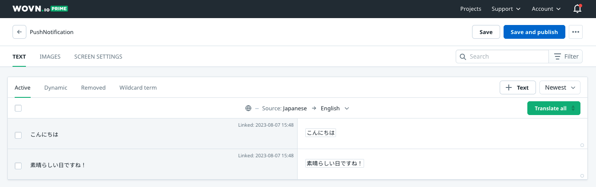
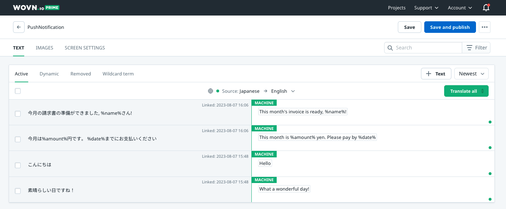

# Wovn Push Notification Feature

Note, this document is primarily applied to Firebase Could Messaging. If you use a different service to send push notifications, please see the relevant section below or get in touch with us.

This document assumes your application is already connected to the Firebase Cloud Messaging service for push notifications. If not, please follow the official [Google document](https://firebase.google.com/docs/cloud-messaging/android/first-message).

## Overview

In this document, you will learn:

1. How Wovn can translate your notification
2. How to allow Wovn to access and then translate notification data from the server before showing it to the end user
3. How to use Wovn to translate notification data containing sensitive user information
4. How to use Wovn to translate local push notification
5. How to integrate Wovn with Fanship for push notifications

## Detail

### 1. How Wovn can translate your notification


1. First, send a test push notification to your test device. This will allow Wovn to report the notification data to Wovn Dashboard and translate it.
2. After Wovn Dashboard translated the notification data, send the same notification again to your test device to confirm.
3. After confirming the notification has been translated, you can send it to all your users.

### 2. How to allow Wovn to access and then translate notification data from the server before showing it to the end user

1. If you haven't extended `FirebaseMessagingService` to add custom logic, please do so by following [this document](https://firebase.google.com/docs/cloud-messaging/android/receive)
2. Add the following code inside the `FirebaseMessagingService` extended class. Please do not forget to import Wovn and other necessary dependencies.

    ```java
    @Override
    public void handleIntent(Intent intentSrc) {
        Intent intentDst = Wovn.translateFirebaseNotificationIntent(intentSrc);
        final String title = intentDst.getStringExtra("title") == null
                ? intentDst.getStringExtra("gcm.notification.title")
                : intentDst.getStringExtra("title");
        final String body = intentDst.getStringExtra("body") == null
                ? intentDst.getStringExtra("gcm.notification.body")
                : intentDst.getStringExtra("body");
        showNotification(title, body);
    }

    public void showNotification(String title, String message) {
        if( title != null || message != null ) {
            Context context = getApplicationContext();
            showNotification(context, title, message);
        }
    }

    public static void showNotification(Context context, String title, String message) {
        final String CHANNEL_ID = "MyChannelId";
        final int NOTIFICATION_ID = 1;
        NotificationManager notificationManager = (NotificationManager) context.getSystemService(Context.NOTIFICATION_SERVICE);

        // Create a notification channel for Android Oreo and above
        if (Build.VERSION.SDK_INT >= Build.VERSION_CODES.O) {
            NotificationChannel channel = new NotificationChannel(CHANNEL_ID, "Channel Name", NotificationManager.IMPORTANCE_DEFAULT);
            notificationManager.createNotificationChannel(channel);
        }

        // Create the notification
        NotificationCompat.Builder builder = new NotificationCompat.Builder(context, CHANNEL_ID)
                .setSmallIcon(R.drawable.arrow_point_to_right)
                .setContentTitle(title)
                .setContentText(message)
                .setAutoCancel(true);

        // Show the notification
        notificationManager.notify(NOTIFICATION_ID, builder.build());
        // For Wovn only
        lastNotiTitle = title;
        lastNotiBody = message;
    }
    ```

3. After step 2, your file should look like this:

    ```java
    package io.wovn.app.demo.activities;

    import android.app.NotificationChannel;
    import android.app.NotificationManager;
    import android.content.Context;
    import android.content.Intent;
    import android.os.Build;

    import androidx.annotation.NonNull;
    import androidx.core.app.NotificationCompat;

    import com.google.firebase.messaging.FirebaseMessagingService;
    import com.google.firebase.messaging.RemoteMessage;

    import io.wovn.app.demo.R;
    import io.wovn.wovnapp.Wovn;

    public class WovnFirebaseMessagingService extends FirebaseMessagingService {
        public static String lastNotiTitle = "";
        public static String lastNotiBody = "";
        @Override
        public void onMessageReceived(@NonNull RemoteMessage remoteMessage) {
            // This function will not be called since we overridden handleIntent
        }

        @Override
        public void handleIntent(Intent intentSrc) {
            Intent intentDst = Wovn.translateFirebaseNotificationIntent(intentSrc);
            final String title = intentDst.getStringExtra("title") == null
                    ? intentDst.getStringExtra("gcm.notification.title")
                    : intentDst.getStringExtra("title");
            final String body = intentDst.getStringExtra("body") == null
                    ? intentDst.getStringExtra("gcm.notification.body")
                    : intentDst.getStringExtra("body");
            showNotification(title, body);
        }

        public void showNotification(String title, String message) {
            if( title != null || message != null ) {
                Context context = getApplicationContext();
                showNotification(context, title, message);
            }
        }

        public static void showNotification(Context context, String title, String message) {
            final String CHANNEL_ID = "MyChannelId";
            final int NOTIFICATION_ID = 1;
            NotificationManager notificationManager = (NotificationManager) context.getSystemService(Context.NOTIFICATION_SERVICE);

            // Create a notification channel for Android Oreo and above
            if (Build.VERSION.SDK_INT >= Build.VERSION_CODES.O) {
                NotificationChannel channel = new NotificationChannel(CHANNEL_ID, "Channel Name", NotificationManager.IMPORTANCE_DEFAULT);
                notificationManager.createNotificationChannel(channel);
            }

            // Create the notification
            NotificationCompat.Builder builder = new NotificationCompat.Builder(context, CHANNEL_ID)
                    .setSmallIcon(R.drawable.arrow_point_to_right)
                    .setContentTitle(title)
                    .setContentText(message)
                    .setAutoCancel(true);

            // Show the notification
            notificationManager.notify(NOTIFICATION_ID, builder.build());
            // For Wovn only
            lastNotiTitle = title;
            lastNotiBody = message;
        }

        @Override
        public void onDeletedMessages() { /*Do nothing*/ }

        @Override
        public void onNewToken(@NonNull String token) { /*Do nothing*/ }
    }
    ```

4. Correct small details like `CHANNEL_ID`, or `Notification icon`, and Wovn will translate all your notifications.

### Testing the feature

1. We can send a push notification to the device via Firebase Cloud Messaging with the following data

    ```json
    {
        "to": "{YOUR TESTING DEVICE FCM TOKEN}",
        "notification": {
            "title": "こんにちは",
            "body": "素晴らしい日ですね！"
        }
    }
    ```

2. For the first time, your test device should receive a notification in Japanese. This is because Wovn does not have the translation for it yet. If you have allowed Wovn to report data, you should be able to find the title and body of the notification inside PushNotification screen in Wovn Dashboard
    - 
    - 
3. After translating the 2 values, then click `Save and publish`, from the next time you send the same notification, it should be translated into the end-user language.
    - 

## 3. How to use Wovn to translate notification data containing sensitive user information

1. Instead of adding user data directly into the `title` or `body` of the notification, you can use `%{variable_name}%` instead, with its data inside data of the notification.

    ```json
    {
        "to": "{YOUR TESTING DEVICE FCM TOKEN}",
        "notification": {
            "title": "今月の請求書の準備ができました, %name%さん!",
            "body": "今月は%amount%円です。 %date%までにお支払いください"
        },
        "data": {
            "name": "John Doe",
            "amount": "10000",
            "date": "2023/12/12"
        }
    }
    ```

2. Follow the same process when testing normal push notifications, your notifications with user-sensitive data can be translated too, without leaking any information.
    - 
    - 

## 4. How to use Wovn to translate local push notification

You can use Wovn.translateNotificationData to translate local push notification data before displaying it.

```java
Map<String, Object> data = new HashMap<>();
data.put("name", "John Doe");
data.put("amount", 2468);
data.put("duration", 31);
String title = Wovn.translateNotificationData("こんにちは%name%さん。%amount%円の請求書があります", data);
String body = Wovn.translateNotificationData("%amount%円を%duration%日以内にお支払いください", data);
// Display local push notification code
```

## 5. How to integrate Wovn with Fanship for push notifications

If you're using Fanship as your push notification service instead of Firebase Cloud Messaging directly, you'll need to implement a step to intercept the translation data. Below is an example of how to integrate Wovn with Fanship:

```kotlin
class MyFirebaseMessagingService : FirebaseMessagingService() {
    override fun onNewToken(newToken: String) {
        super.onNewToken(newToken)
        Log.d("MyFirebaseMessagingService", "FCM onNewToken: $newToken")
        // Register FCM token with Fanship
        Popinfo.setToken(this, newToken)
    }

    override fun onMessageReceived(remoteMessage: RemoteMessage) {
        super.onMessageReceived(remoteMessage)
        // Translate the message data with Wovn before handling it with Fanship
        Wovn.translateFanshipRemoteMessageData(remoteMessage.data)
        // Let Fanship handle the FCM message
        Popinfo.fcmMessageHandler(this, remoteMessage)
    }
}
```

Make sure to include all necessary imports for both Wovn and Fanship in your implementation. The key part is to call `Wovn.translateFanshipRemoteMessageData()` with the remote message data before passing it to Fanship's message handler.

Follow the same testing procedure as outlined in the previous sections to ensure your Fanship notifications are being properly translated by Wovn.
