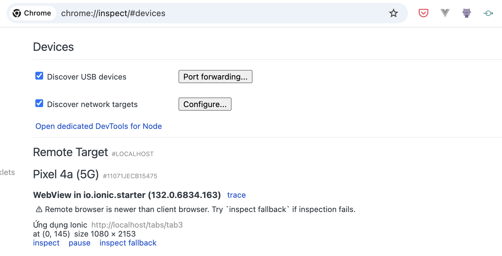

# WOVN Cordova Plugin

A Cordova plugin for WOVN integration

## Installation

1. Download the plugin package using the link shared by the WOVN team.

2. Create a `dist` directory in your project (if it doesn't exist) and unzip the package:
   ```bash
   mkdir -p dist
   cd dist
   unzip ~/Downloads/cordova-plugin-wovn_[VERSION].zip
   ```

3. Add the plugin to your Cordova project:
   ```bash
   cordova plugin add ./dist/cordova-plugin-wovn
   ```

   Or for Ionic projects:
   ```bash
   ionic cordova plugin add ./dist/cordova-plugin-wovn
   ```

## Usage

Update your `app.component.ts` to initialize the WOVN plugin:

```typescript
import { Component } from '@angular/core';
import { IonApp, IonRouterOutlet, Platform } from '@ionic/angular/standalone';

// Add this line
declare const Wovn: any;

...

export class AppComponent {
  constructor(private platform: Platform) {
    // Add this block 
    document.addEventListener('deviceready', () => {
      if (typeof Wovn !== 'undefined') {
        Wovn.initialize('YOUR_WOVN_KEY')
          .then(() => console.log('Wovn initialized successfully'))
          .catch(error => console.error('Failed to initialize Wovn:', error));
      }
    }, false);
  }
}
```

Replace `'YOUR_WOVN_KEY'` with your actual WOVN project key.

## Troubleshooting

### Check if the plugin is installed

```
cordova plugin list
```

should show similar results to:

```
cordova-plugin-device 2.0.2 "Device"
cordova-plugin-ionic-keyboard 2.2.0 "cordova-plugin-ionic-keyboard"
cordova-plugin-ionic-webview 5.0.0 "cordova-plugin-ionic-webview"
cordova-plugin-splashscreen 5.0.2 "Splashscreen"
cordova-plugin-statusbar 2.4.2 "StatusBar"
cordova-plugin-wovn 0.1.0 "Wovn"
```

### Check if the plugin is initialized

1. Connect the device to your computer and open Chrome DevTools.
   ```
   chrome://inspect
   ```
   
Open the app, look for the correspondent tab and click on "inspect" .

2. Open the browser console and check for the following log message:
   ```
   Wovn initialized successfully
   ```

if you don't see this message, please make sure that the plugin is correctly installed and initialized.
You might need to include

```html
<script src="cordova.js"></script>
```

in your `src/index.html` file to have Cordova available in your app.