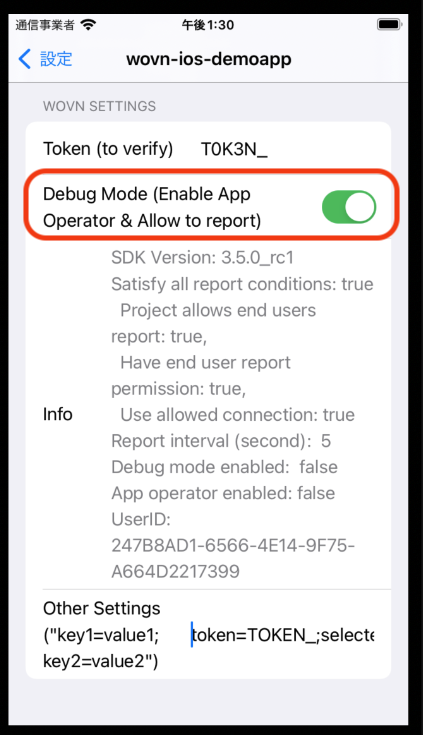

# WOVN Debug Mode Feature

The **Debug Mode** feature in WOVN streamlines app development and testing by enabling **App Operator Mode**. This mode provides faster reporting/translation updates while ensuring user privacy when combined with the **Limit reporting to only app operator** setting.

## Key Benefits

- **Accelerated Feedback Cycle**: Enables rapid reporting and re-translation during development (updates every ~10 seconds).
- **Privacy Protection**: Prevents end-user data transmission to WOVN when used with privacy restrictions.

## Feature Overview

Enabling Debug Mode activates **App Operator Mode** with:

1. **Frequent Updates**  
   Content re-translation and data reporting every 10 seconds for real-time feedback.

2. **Privacy Safeguards**  
   Restricts data reporting exclusively to app operators in debug environments.

## Activation Methods

### Method 1: Programmatic Activation

Enable Debug Mode through code using the `start` method. Pass `true` to `isDebugMode` to enable `Debug Mode`. Common approaches include:

**Option A: Using Build Configuration Check `_isDebugAssertConfiguration()`**  

```swift
Wovn.start(isDebugMode: _isDebugAssertConfiguration())
```

**Example Implementation (Swift):**

```swift
class AppDelegate: UIResponder, UIApplicationDelegate {
    func application(_ application: UIApplication, didFinishLaunchingWithOptions launchOptions: [UIApplication.LaunchOptionsKey: Any]?) -> Bool {
        // ...
        // Using internal configuration check
        Wovn.start(isDebugMode: _isDebugAssertConfiguration())
        // ...
    }
}
```

**Option B: Using Standard `#if DEBUG` Directive**  

```swift
class AppDelegate: UIResponder, UIApplicationDelegate {
    func application(_ application: UIApplication, didFinishLaunchingWithOptions launchOptions: [UIApplication.LaunchOptionsKey: Any]?) -> Bool {
        // ...
        #if DEBUG
            Wovn.start(isDebugMode: true)  // Debug builds
        #else
            Wovn.start(isDebugMode: false) // Production builds
        #endif
        // ...
    }
}
```

> **Build Configuration Notes**  
>
> 1. `_isDebugAssertConfiguration()` internally checks Xcode's `DEBUG` flag configuration
> 2. `#if DEBUG` is the standard Swift preprocessor directive for:  
>    - `true` in debug builds (development/testing)  
>    - `false` in production releases  
>
> Both methods automatically separate environments without manual configuration.  
> *Ensure `DEBUG` flag is set in your target's build settings for debug schemes.*

### Method 2: WOVN Settings Screen

Enable through the app interface after initial setup:

1. Navigate to **Settings → your application**
2. Enter your WOVN token in **Validation Token**
3. Toggle **Debug Mode** switch ON

*For setup details, see [WOVN Settings Integration Guide](./setup_wovn_settings_in_app_info.md).*



## Verification (From v3.5.0)

Check activation status programmatically:

```swift
let debugStatus = Wovn.getDebugStatus()
// Returns human-readable status including Debug Mode state
```
