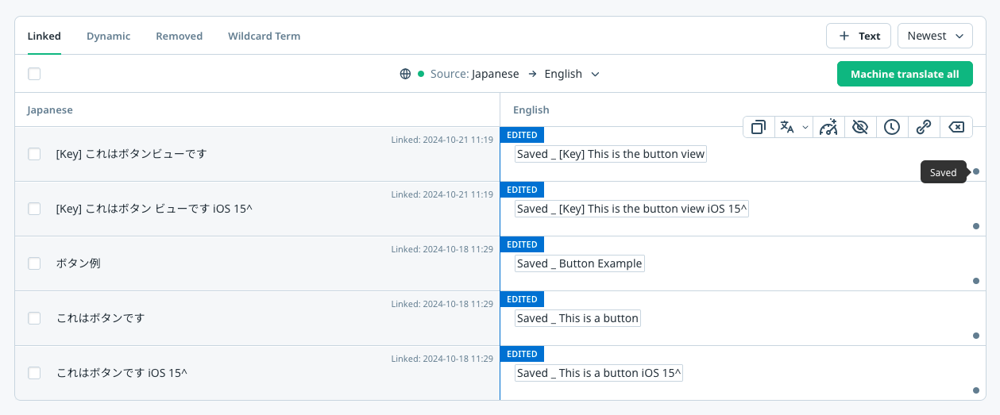

# Preview Translation Feature

The **Preview Translation** feature allows `app operators` to preview the translated version of the app without publishing the changes. This feature is particularly useful for verifying translation quality and ensuring the layout of the translated app is correct before making the changes public.

## How It Works

When the Preview Translation feature is enabled, the SDK behaves as follows:

- **End users** see the `published` translations. These are the translations made public after clicking the `Save and Publish` button in the Wovn Dashboard.  
  

- **App operators** see the `saved` translations. These are the translations saved but not yet published, which can be previewed after clicking the `Save` button in the Wovn Dashboard.  
  

## How to Enable Preview Translation

To enable the Preview Translation feature, follow these steps:

1. **Enable Debug Mode for Test Devices**  
   Refer to the [Debug Mode Documentation](./debug_mode.md) for instructions on enabling debug mode on test devices.

2. **Update the `WOVNswift.plist` File**  
   Add `translation_preview_mode=true` to the `WOVNswift.plist` file:

   ```xml
   <key>token</key>
   <string>YOUR_WOVN_PROJECT_TOKEN</string>
   <key>translation_preview_mode</key>
   <true/>
   ```

3. **Remove and Reinstal the App**
   Save the changes to the `WOVNswift.plist` file and reinstall the app.

### Result

- Devices with **debug mode enabled** will display the saved translations.
- Devices without **debug mode enabled** will display the published translations.
