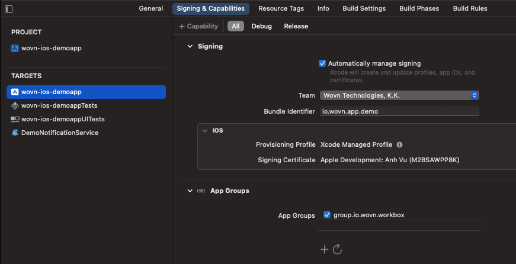

# Wovn Push Notification Feature

This document assumes your app already can receive push notifications from Apple Push Notification service (APNs) or Firebase.

## Overview

In this document, you will learn:

1. How Wovn can translate your notification
2. How to allow Wovn to access and then translate notification data from the server before showing it to the end user
3. How to use Wovn to translate notification data containing sensitive user information
4. How to use Wovn to translate local push notification

## Detail

### 1. How Wovn can translate your notification


1. First, send a test push notification to your test device. This will allow Wovn to report the notification data to Wovn Dashboard and translate it.
2. After Wovn Dashboard translated the notification data, send the same notification again to your test device to confirm.
3. After confirming the notification has been translated, you can send it to all your users.

### 2. How to allow Wovn to access and then translate notification data from the server before showing it to the end user

1. In your server, make sure to add `"mutable_content": true` to all push notifications. Without it, Apple will assume your notification will need no further editing and will display it without allowing any process to make any modification.
2. If you haven’t extended UNNotificationServiceExten, to add custom logic, please do so by following this document by Apple: https://developer.apple.com/documentation/usernotifications/unnotificationserviceextension
3. Since UNNotificationServiceExtension and your app run in separate sandboxes, we need to create a bridge to share data between them. We will use App Groups to do it:
    - Add `group.io.wovn.workbox` to `App Groups` of your main app. wovn-ios-demoapp in this example. 
    - Add `group.io.wovn.workbox` to `App Groups` of your Notification Service Extension. 
4. Notify `Wovn SDK` in both the main app and UNNotificationServiceExtension about the App Groups `group.io.wovn.workbox`. Then translate push notifications.
    - In AppDelegate.swift, change the `Wovn.start`'s code parameters of `appGroupIdentifier` to `"group.io.wovn.workbox"`, and `isNotificationServiceEnv` to `false`. Example: `Wovn.start(appGroupIdentifier: "group.io.wovn.workbox", isNotificationServiceEnv: false)`

    ```swift
    func application(_ application: UIApplication, didFinishLaunchingWithOptions launchOptions: [UIApplication.LaunchOptionsKey: Any]?) -> Bool {
        // Some application code

        // [BEFORE]
        // Wovn.start(isDebugMode: _isDebugAssertConfiguration(), autoTranslateUIKit: true)

        // [AFTER]
        Wovn.start(
            appGroupIdentifier: "group.io.wovn.workbox",
            isDebugMode: _isDebugAssertConfiguration(),
            autoTranslateUIKit: true,
            isNotificationServiceEnv: false
        )
        // Some wovn code
        // Some other application code
    }
    ```

    - Add the following code to NotificationService.swift in the UNNotificationServiceExtension folder.

    ```swift
    import UserNotifications
    import WOVNswift

    class NotificationService: UNNotificationServiceExtension {

        var contentHandler: ((UNNotificationContent) -> Void)?
        var bestAttemptContent: UNMutableNotificationContent?

        override func didReceive(_ request: UNNotificationRequest, withContentHandler contentHandler: @escaping (UNNotificationContent) -> Void) {
            Wovn.start(appGroupIdentifier: "group.io.wovn.workbox", isNotificationServiceEnv: true)
            self.contentHandler = contentHandler
            bestAttemptContent = (request.content.mutableCopy() as? UNMutableNotificationContent)
            if let bestAttemptContent = bestAttemptContent {
                let translatedContent = Wovn.translateNotificationContent(notiContent: bestAttemptContent)
                contentHandler(translatedContent)
            }
        }

        override func serviceExtensionTimeWillExpire() {
            // Called just before the extension will be terminated by the system.
            // Use this as an opportunity to deliver your "best attempt" at modified content, otherwise the original push payload will be used.
            if let contentHandler = contentHandler, let bestAttemptContent = bestAttemptContent {
                contentHandler(bestAttemptContent)
            }
        }
    }

    ```

5. After step 4, your push notification content is translated, and stored in translatedContent. In the code above, we just go ahead and display it. But you can customize it further before showing it to the end user.

### Testing the feature

1. We can send a push notification to the device via Firebase Cloud Messaging with the following data

    ```json
    {
        "to": "{YOUR TESTING DEVICE FCM TOKEN}",
        "notification": {
            "mutable_content": true, // Don't forget this line
            "title": "こんにちは",
            "body": "素晴らしい日ですね！"
        }
    }
    ```

2. For the first time, your test device should receive a notification in Japanese. This is because Wovn does not have the translation for it yet. If you have allowed Wovn to report data, you should be able to find the title and body of the notification inside PushNotification screen in Wovn Dashboard
    - 
    - 
3. After translating the 2 values, then click `Save and publish`, from the next time you send the same notification, it should be translated into the end-user language.
    - 

## 3. How to use Wovn to translate notification data containing sensitive user information

1. Instead of adding user data directly into the `title` or `body` of the notification, you can use `%{variable_name}%` instead, with its data inside data of the notification.

    ```json
    {
        "to": "{YOUR TESTING DEVICE FCM TOKEN}",
        "notification": {
            "mutable_content": true, // Don't forget this line
            "title": "今月の請求書の準備ができました, %name%さん!",
            "body": "今月は%amount%円です。 %date%までにお支払いください"
        },
        "data": {
            "name": "John Doe",
            "amount": "10000",
            "date": "2023/12/12"
        }
    }
    ```

2. Follow the same process when testing normal push notifications, your notifications with user-sensitive data can be translated too, without leaking any information.
    - 
    - 

## 4. How to use Wovn to translate local push notification

You can use `Wovn.translateNotificationData` to translate local push notification data before displaying it.

```swift
var content = UNMutableNotificationContent()
content.title = "こんにちは%name%さん"
content.subtitle = "お金を払ってください.%amount%ドルです"
content.body = "期限内にお支払いをお願いいたします。%amount%ドルです"
content.userInfo.updateValue("Jone Doe", forKey: "name")
content.userInfo.updateValue("150", forKey: "amount")
content.userInfo.updateValue("2099/12/12", forKey: "date")
content.sound = UNNotificationSound.default
content = Wovn.translateNotificationContent(notiContent: content)
// Display local push notification code
```
