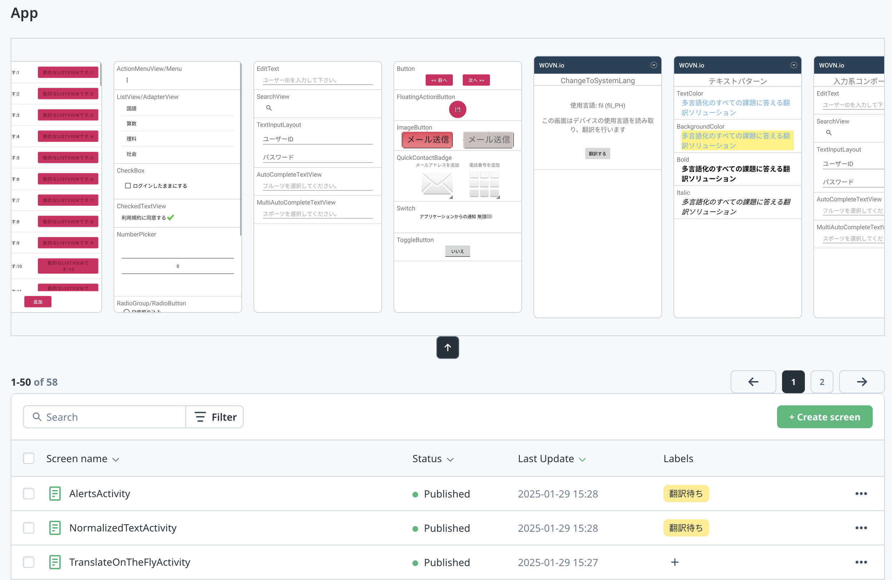

# スクリーンプロフィール画像機能 (自動翻訳)

スクリーンプロフィール画像機能を使用すると、画面名の代わりに視覚的なプロフィール画像で素早くスクリーンを特定できます。複雑な命名規則を持つスクリーンや、WOVNダッシュボードを操作する非技術系のユーザーに最適です。

## セットアップ手順

### 1. 機能の有効性確認

本機能はデフォルトで有効化されています。ステータス確認が必要な場合はWOVNサポートまでお問い合わせください。

### 2. デバッグモードの有効化

アプリケーションをWOVNの**デバッグモード**で実行していることを確認してください。  
> **注意**: 有効化方法は[デバッグモードドキュメント](./debug_mode.md)をご参照ください。

### 3. ソース言語でのアプリケーション使用

- WOVN SDKによるスクリーンショットの自動取得は**ソース言語でアプリケーションを使用している時のみ**行われます
- スクリーンショットはバックグラウンドでWOVNサーバーにアップロードされ、手動操作は不要です

### 4. ダッシュボードでのプロフィール画像確認

**WOVNダッシュボード**にアクセスし、スクリーン一覧を表示してください。アップロードされたプロフィール画像が各スクリーンに表示されます。