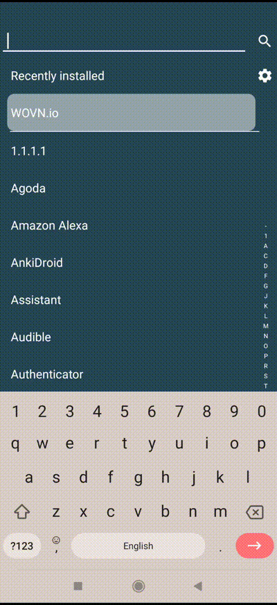

# アプリ情報における WOVN 設定画面 (自動翻訳)

`WOVN 設定画面` 機能は、ユーザーがアプリの翻訳設定を管理できるようにする事前設定されたインターフェースを提供します。この機能は以下の目的で設計されています：

- 非技術的なチームメンバーがデバッグモードを簡単に切り替え、迅速な報告や再翻訳を可能にします。`アプリ運営者のみに報告を制限` と併用することで、ユーザーのプライバシーを確保します。
- 報告状況、ユーザーID、その他の関連詳細など、トラブルシューティングに必要なデバッグ情報を簡単に表示する方法を提供します。

## 設定手順

WOVN 設定画面をアプリに統合するには、以下のコードを `AndroidManifest.xml` ファイルに追加してください。この設定により、アプリの「アプリ情報」セクションに事前設定された WOVN 設定画面が追加されます。

```xml
<activity
    android:name="io.wovn.wovnapp.debugmode.WovnSettingsActivity"
    android:label="翻訳設定"
    android:exported="true">
    <intent-filter>
        <action android:name="android.intent.action.APPLICATION_PREFERENCES" />
        <category android:name="android.intent.category.DEFAULT" />
    </intent-filter>
</activity>
```

## デモンストレーション

以下のビデオで WOVN 設定画面の機能をプレビューできます：



## 注意事項

1. ユーザーは設定を変更するために `検証トークン` フィールドに正しいトークンを入力する必要があります。これにより、権限のあるユーザーのみが変更を行えるようになります。