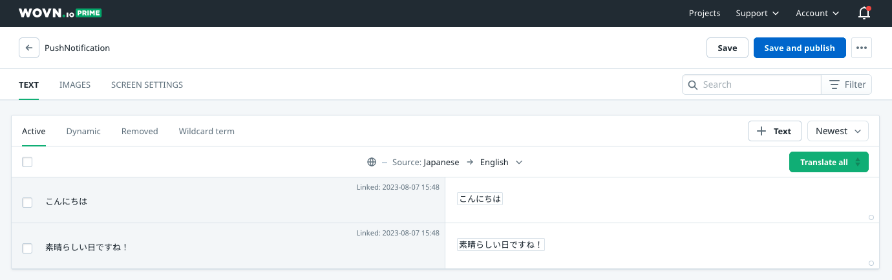

# WOVN プッシュ通知機能 (自動翻訳)

注意: このドキュメントは Firebase Cloud Messaging のみを対象としています。別のサービスを使用してプッシュ通知を送信する場合は、お問い合わせください。

このドキュメントでは、アプリケーションが既にプッシュ通知用に Firebase Cloud Messaging サービスに接続されていることを前提としています。まだ接続していない場合は、公式の [Google ドキュメント](https://firebase.google.com/docs/cloud-messaging/android/first-message) に従ってください。

## 概要

このドキュメントでは、以下のことを学びます：

1. WOVN が通知をどのように翻訳できるか
2. エンドユーザーに表示する前にサーバーからの通知データにアクセスし、翻訳するために WOVN を許可する方法
3. 敏感なユーザー情報を含む通知データを翻訳するために WOVN を使用する方法
4. ローカルプッシュ通知を翻訳するために WOVN を使用する方法

## 詳細

### 1. WOVN が通知をどのように翻訳できるか


1. まず、テストデバイスにテストプッシュ通知を送信します。これにより、WOVN は通知データを WOVN ダッシュボードに報告し、翻訳できるようになります。
2. WOVN ダッシュボードが通知データを翻訳した後、同じ通知を再度テストデバイスに送信して確認します。
3. 通知が翻訳されたことを確認したら、すべてのユーザーに通知を送信できます。

### 2. エンドユーザーに表示する前にサーバーからの通知データにアクセスし、翻訳するために WOVN を許可する方法

1. `FirebaseMessagingService` を拡張してカスタムロジックを追加していない場合は、[このドキュメント](https://firebase.google.com/docs/cloud-messaging/android/receive) に従って拡張してください。
2. `FirebaseMessagingService` を拡張したクラス内に以下のコードを追加します。WOVN およびその他の必要な依存関係をインポートすることを忘れないでください。

    ```java
    @Override
    public void handleIntent(Intent intentSrc) {
        Intent intentDst = Wovn.translateFirebaseNotificationIntent(intentSrc);
        final String title = intentDst.getStringExtra("title") == null
                ? intentDst.getStringExtra("gcm.notification.title")
                : intentDst.getStringExtra("title");
        final String body = intentDst.getStringExtra("body") == null
                ? intentDst.getStringExtra("gcm.notification.body")
                : intentDst.getStringExtra("body");
        showNotification(title, body);
    }

    public void showNotification(String title, String message) {
        if( title != null || message != null ) {
            Context context = getApplicationContext();
            showNotification(context, title, message);
        }
    }

    public static void showNotification(Context context, String title, String message) {
        final String CHANNEL_ID = "MyChannelId";
        final int NOTIFICATION_ID = 1;
        NotificationManager notificationManager = (NotificationManager) context.getSystemService(Context.NOTIFICATION_SERVICE);

        // Android Oreo 以降用の通知チャンネルを作成
        if (Build.VERSION.SDK_INT >= Build.VERSION_CODES.O) {
            NotificationChannel channel = new NotificationChannel(CHANNEL_ID, "Channel Name", NotificationManager.IMPORTANCE_DEFAULT);
            notificationManager.createNotificationChannel(channel);
        }

        // 通知を作成
        NotificationCompat.Builder builder = new NotificationCompat.Builder(context, CHANNEL_ID)
                .setSmallIcon(R.drawable.arrow_point_to_right)
                .setContentTitle(title)
                .setContentText(message)
                .setAutoCancel(true);

        // 通知を表示
        notificationManager.notify(NOTIFICATION_ID, builder.build());
        // WOVN 用
        lastNotiTitle = title;
        lastNotiBody = message;
    }
    ```

3. ステップ2の後、ファイルは以下のようになります：

    ```java
    package io.wovn.app.demo.activities;

    import android.app.NotificationChannel;
    import android.app.NotificationManager;
    import android.content.Context;
    import android.content.Intent;
    import android.os.Build;

    import androidx.annotation.NonNull;
    import androidx.core.app.NotificationCompat;

    import com.google.firebase.messaging.FirebaseMessagingService;
    import com.google.firebase.messaging.RemoteMessage;

    import io.wovn.app.demo.R;
    import io.wovn.wovnapp.Wovn;

    public class WovnFirebaseMessagingService extends FirebaseMessagingService {
        public static String lastNotiTitle = "";
        public static String lastNotiBody = "";
        @Override
        public void onMessageReceived(@NonNull RemoteMessage remoteMessage) {
            // この関数は handleIntent をオーバーライドしているため呼び出されません
        }

        @Override
        public void handleIntent(Intent intentSrc) {
            Intent intentDst = Wovn.translateFirebaseNotificationIntent(intentSrc);
            final String title = intentDst.getStringExtra("title") == null
                    ? intentDst.getStringExtra("gcm.notification.title")
                    : intentDst.getStringExtra("title");
            final String body = intentDst.getStringExtra("body") == null
                    ? intentDst.getStringExtra("gcm.notification.body")
                    : intentDst.getStringExtra("body");
            showNotification(title, body);
        }

        public void showNotification(String title, String message) {
            if( title != null || message != null ) {
                Context context = getApplicationContext();
                showNotification(context, title, message);
            }
        }

        public static void showNotification(Context context, String title, String message) {
            final String CHANNEL_ID = "MyChannelId";
            final int NOTIFICATION_ID = 1;
            NotificationManager notificationManager = (NotificationManager) context.getSystemService(Context.NOTIFICATION_SERVICE);

            // Android Oreo 以降用の通知チャンネルを作成
            if (Build.VERSION.SDK_INT >= Build.VERSION_CODES.O) {
                NotificationChannel channel = new NotificationChannel(CHANNEL_ID, "Channel Name", NotificationManager.IMPORTANCE_DEFAULT);
                notificationManager.createNotificationChannel(channel);
            }

            // 通知を作成
            NotificationCompat.Builder builder = new NotificationCompat.Builder(context, CHANNEL_ID)
                    .setSmallIcon(R.drawable.arrow_point_to_right)
                    .setContentTitle(title)
                    .setContentText(message)
                    .setAutoCancel(true);

            // 通知を表示
            notificationManager.notify(NOTIFICATION_ID, builder.build());
            // WOVN 用
            lastNotiTitle = title;
            lastNotiBody = message;
        }

        @Override
        public void onDeletedMessages() { /* 何もしない */ }

        @Override
        public void onNewToken(@NonNull String token) { /* 何もしない */ }
    }
    ```

4. `CHANNEL_ID` や `Notification icon` などの小さな詳細を修正すると、WOVN はすべての通知を翻訳します。

### 機能のテスト

1. 以下のデータを使用して、Firebase Cloud Messaging 経由でデバイスにプッシュ通知を送信できます。

    ```json
    {
        "to": "{YOUR TESTING DEVICE FCM TOKEN}",
        "notification": {
            "title": "こんにちは",
            "body": "素晴らしい日ですね！"
        }
    }
    ```

2. 初回は、テストデバイスが日本語の通知を受け取るはずです。これは WOVN がまだその翻訳を持っていないためです。WOVN にデータの報告を許可している場合、通知のタイトルと本文は WOVN ダッシュボードの PushNotification 画面内で確認できます。
    - 
    - 
3. 2つの値を翻訳した後、`Save and publish` をクリックすると、次回同じ通知を送信した際にエンドユーザーの言語に翻訳されるはずです。
    - 

## 3. 敏感なユーザー情報を含む通知データを翻訳するために WOVN を使用する方法

1. 通知の `title` や `body` に直接ユーザーデータを追加する代わりに、`%{variable_name}%` を使用し、データを通知の `data` 内に含めることができます。

    ```json
    {   
        "to": "{YOUR TESTING DEVICE FCM TOKEN}",
        "notification": {
            "title": "今月の請求書の準備ができました, %name%さん!",
            "body": "今月は%amount%円です。 %date%までにお支払いください"
        },
        "data": {
            "name": "John Doe",
            "amount": "10000",
            "date": "2023/12/12"
        }  
    }
    ```

2. 通常のプッシュ通知をテストする際と同じプロセスに従い、ユーザーの機密データを含む通知も情報漏洩せずに翻訳できます。
    - 
    - 

## 4. ローカルプッシュ通知を翻訳するために WOVN を使用する方法

`Wovn.translateNotificationData` を使用して、ローカルプッシュ通知データを表示前に翻訳できます。

```java
Map<String, Object> data = new HashMap<>();
data.put("name", "John Doe");
data.put("amount", 2468);
data.put("duration", 31);
String title = Wovn.translateNotificationData("こんにちは%name%さん。%amount%円の請求書があります", data);
String body = Wovn.translateNotificationData("%amount%円を%duration%日以内にお支払いください", data);
// ローカルプッシュ通知を表示するコード
```
