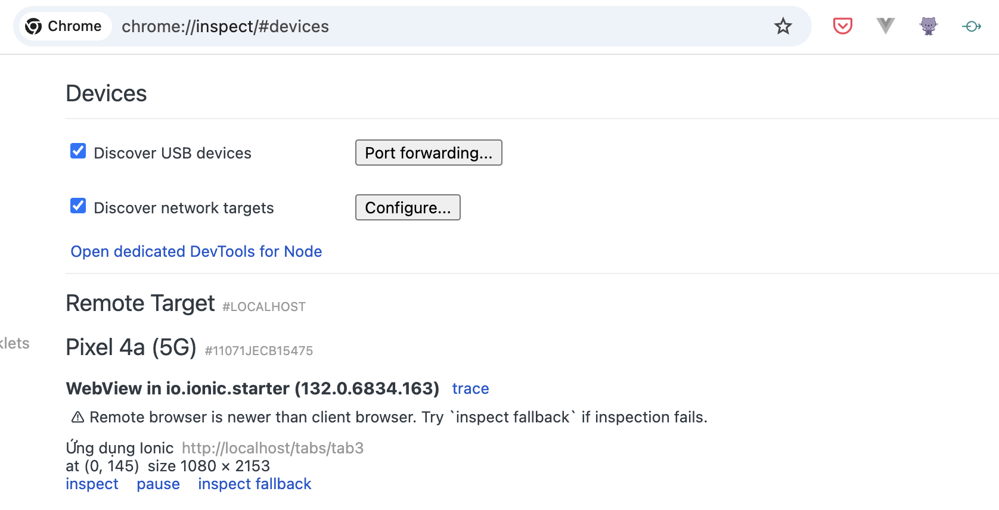

# WOVN Cordova プラグイン

WOVN連携のためのCordovaプラグイン

## インストール方法

1. WOVNチームから共有されたリンクを使用してプラグインパッケージをダウンロードします。

2. プロジェクトに`dist`ディレクトリを作成し（存在しない場合）、パッケージを解凍します：
   ```bash
   mkdir -p dist
   cd dist
   unzip ~/Downloads/cordova-plugin-wovn_[VERSION].zip
   ```

3. Cordovaプロジェクトにプラグインを追加します：
   ```bash
   cordova plugin add ./dist/cordova-plugin-wovn
   ```

   Ionicプロジェクトの場合：
   ```bash
   ionic cordova plugin add ./dist/cordova-plugin-wovn
   ```

## 使用方法

WOVNプラグインを初期化するために`app.component.ts`を更新します：

```typescript
import { Component } from '@angular/core';
import { IonApp, IonRouterOutlet, Platform } from '@ionic/angular/standalone';

// Add this line
declare const Wovn: any;

...

export class AppComponent {
   constructor(private platform: Platform) {
      // Add this block 
      document.addEventListener('deviceready', () => {
         if (typeof Wovn !== 'undefined') {
            Wovn.initialize('YOUR_WOVN_KEY')
                    .then(() => console.log('Wovn initialized successfully'))
                    .catch(error => console.error('Failed to initialize Wovn:', error));
         }
      }, false);
   }
}
```

`'YOUR_WOVN_KEY'`を実際のWOVNプロジェクトキーに置き換えてください。

## トラブルシューティング

### プラグインがインストールされているか確認

```
cordova plugin list
```

以下のような結果が表示されるはずです：

```
cordova-plugin-device 2.0.2 "Device"
cordova-plugin-ionic-keyboard 2.2.0 "cordova-plugin-ionic-keyboard"
cordova-plugin-ionic-webview 5.0.0 "cordova-plugin-ionic-webview"
cordova-plugin-splashscreen 5.0.2 "Splashscreen"
cordova-plugin-statusbar 2.4.2 "StatusBar"
cordova-plugin-wovn 0.1.0 "Wovn"
```

### プラグインが初期化されているか確認

1. デバイスをコンピュータに接続し、Chrome DevToolsを開きます。
   ```
   chrome://inspect
   ```

アプリを開き、対応するタブを探して"inspect"をクリックします。 

2. ブラウザのコンソールを開き、以下のログメッセージを確認します：
   ```
   Wovn initialized successfully
   ```

このメッセージが表示されない場合は、プラグインが正しくインストールおよび初期化されていることを確認してください。
アプリでCordovaを利用可能にするために、`src/index.html`ファイルに以下を追加する必要があるかもしれません：

```html
<script src="cordova.js"></script>
```