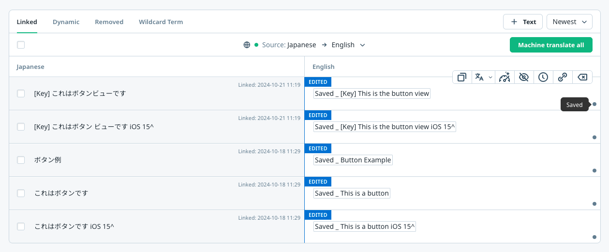

# 翻訳プレビューフィーチャー (自動翻訳)

**翻訳プレビューフィーチャー**を使用すると、`アプリオペレーター`がアプリの翻訳されたバージョンを公開せずにプレビューすることができます。この機能は、翻訳の品質を確認し、翻訳されたアプリのレイアウトが正しいかを公開前に確認するのに特に役立ちます。

## 動作概要

翻訳プレビューフィーチャーが有効になっている場合、SDKは以下のように動作します：

- **エンドユーザー**は`公開済み`の翻訳を閲覧します。これらはWovnダッシュボードで`保存して公開`ボタンをクリックした後に公開された翻訳です。  
  

- **アプリオペレーター**は`保存済み`の翻訳を閲覧します。これらはまだ公開されていない翻訳で、Wovnダッシュボードの`保存`ボタンをクリックした後にプレビューできます。  
  

## 翻訳プレビューの有効化手順

翻訳プレビューフィーチャーを有効化するには、以下の手順に従ってください：

1. **テストデバイスでデバッグモードを有効化する**  
   デバイスでデバッグモードを有効化する手順については、[デバッグモードドキュメント](./debug_mode.md)を参照してください。

2. **`Wovn.initWovn`の呼び出しを更新する**  
   `Wovn.initWovn`の呼び出しに`enableTranslationPreviewMode: true`を追加します：

   ```javascript
   await Wovn.initWovn('YOUR_WOVN_PROJECT_TOKEN', {
      enableTranslationPreviewMode: true,
   });
   ```

3. **アプリを保存して再起動する**  
   変更を保存し、アプリを再起動します。

### 結果

- **デバッグモードが有効化されているデバイス**は保存済みの翻訳を表示します。
- **デバッグモードが有効化されていないデバイス**は公開済みの翻訳を表示します。
