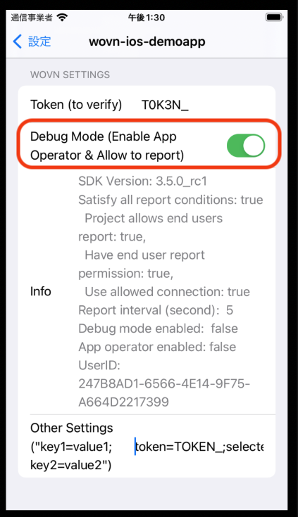

# WOVN デバッグモード機能 (自動翻訳)

WOVN の **デバッグモード** 機能は、**アプリオペレーターモード** を有効にすることで、アプリの開発とテストを効率化します。このモードは、**レポートをアプリオペレーターのみに制限** 設定と組み合わせることで、ユーザーのプライバシーを確保しつつ、より迅速なレポートおよび翻訳の更新を提供します。

## 主な利点

- **フィードバックサイクルの加速**：開発中の迅速なレポートおよび再翻訳を可能にし（約10秒ごとに更新）。
- **プライバシー保護**：プライバシー制限と併用することで、エンドユーザーのデータが WOVN に送信されるのを防止。

## 機能概要

デバッグモードを有効にすると、**アプリオペレーターモード** が以下のようにアクティブになります：

1. **頻繁な更新**  
   リアルタイムフィードバックのため、コンテンツの再翻訳とデータのレポートが10秒ごとに行われます。

2. **プライバシーの保護**  
   デバッグ環境において、データのレポートをアプリオペレーターのみに限定します。

## 有効化方法

### 方法 1：プログラムによる有効化

`start` メソッドを使用してコード内でデバッグモードを有効にします。`isDebugMode` に `true` を渡すことで **デバッグモード** を有効にします。一般的な方法は以下の通りです：

**オプション A：ビルド構成チェック `_isDebugAssertConfiguration()` を使用**

```swift
Wovn.start(isDebugMode: _isDebugAssertConfiguration())
```

**実装例（Swift）：**

```swift
class AppDelegate: UIResponder, UIApplicationDelegate {
    func application(_ application: UIApplication, didFinishLaunchingWithOptions launchOptions: [UIApplication.LaunchOptionsKey: Any]?) -> Bool {
        // ...
        // 内部の構成チェックを使用
        Wovn.start(isDebugMode: _isDebugAssertConfiguration())
        // ...
    }
}
```

**オプション B：標準の `#if DEBUG` ディレクティブを使用**

```swift
class AppDelegate: UIResponder, UIApplicationDelegate {
    func application(_ application: UIApplication, didFinishLaunchingWithOptions launchOptions: [UIApplication.LaunchOptionsKey: Any]?) -> Bool {
        // ...
        #if DEBUG
            Wovn.start(isDebugMode: true)  // デバッグビルド
        #else
            Wovn.start(isDebugMode: false) // 本番ビルド
        #endif
        // ...
    }
}
```

> **ビルド構成に関する注意事項**
>
> 1. `_isDebugAssertConfiguration()` は内部的に Xcode の `DEBUG` フラグ構成をチェックします。
> 2. `#if DEBUG` は標準的な Swift のプリプロセッサディレクティブであり、以下の通りです：  
>    - デバッグビルド（開発/テスト）では `true`  
>    - 本番リリースでは `false`  
>
> 両方の方法は、手動の構成なしに環境を自動的に分離します。  
> *デバッグスキーム用にターゲットのビルド設定で `DEBUG` フラグが設定されていることを確認してください。*

### 方法 2：WOVN 設定画面

初期設定後、アプリのインターフェースを通じて有効にします：

1. **設定 → あなたのアプリケーション** に移動
2. **バリデーショントークン** に WOVN トークンを入力
3. **デバッグモード** スイッチを ON に切り替え

*セットアップの詳細については、[WOVN 設定統合ガイド](./setup_wovn_settings_in_app_info.md) を参照してください。*



## 検証（v3.5.0 以降）

プログラムによって有効化ステータスを確認します：

```swift
let debugStatus = Wovn.getDebugStatus()
// デバッグモードの状態を含む人間が読みやすいステータスを返します
```
