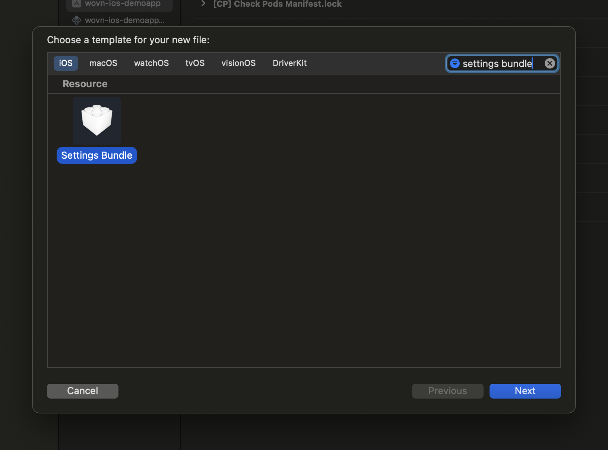

# iOS設定アプリへのWOVN Settings統合 (自動翻訳)

このドキュメントでは、WOVN Settings画面機能の概要と、それをiOS設定アプリに統合するためのステップバイステップの手順を提供します。

## 概要

WOVN Settings画面は、iOS設定アプリ内に組み込まれた事前設定済みのインターフェースです。ユーザーはアプリの翻訳関連設定を管理できます。主な機能は `isDebugMode` トグルで、オペレーターモードを有効にします。このモードを有効にすると、レポート頻度と再翻訳の頻度が10秒ごとに増加します。

さらに、この画面ではレポートステータス、ユーザーID、その他のトラブルシューティング情報などの有用なデバッグ情報が表示されます。

## セットアップ手順

WOVN Settings画面を統合するには、以下の手順に従ってください：

1. **Settings Bundleを追加する**:
   - まだ追加していない場合は、プロジェクトに `Settings Bundle` を追加します。これは以下の手順で行えます：
     - `File > New > File > Settings Bundle` に移動します。
   - 一度追加すると、バンドルはプロジェクト構造に含まれます。

   

2. **`Root.plist`を修正する**:
   - `Settings.Bundle` フォルダ内で `Root.plist` ファイルを見つけます。
   - `Root.plist` に以下のXMLコードを追加します。既にファイルが存在する場合は、`<!-- WOVN Settings section start -->` と `<!-- WOVN Settings section end -->` の間のセクションのみをコピーしてください。

    ```xml
    <?xml version="1.0" encoding="UTF-8"?>
    <!DOCTYPE plist PUBLIC "-//Apple//DTD PLIST 1.0//EN" "http://www.apple.com/DTDs/PropertyList-1.0.dtd">
    <plist version="1.0">
    <dict>
        <key>StringsTable</key>
        <string>Root</string>
        <key>PreferenceSpecifiers</key>
        <array>
            <!-- WOVN Settings section start -->
            <dict>
                <key>Type</key>
                <string>PSGroupSpecifier</string>
                <key>Title</key>
                <string>翻訳設定</string>
            </dict>
            <dict>
                <key>Type</key>
                <string>PSTextFieldSpecifier</string>
                <key>Title</key>
                <string>バリデーショントークン</string>
                <key>Key</key>
                <string>verify_token</string>
            </dict>
            <dict>
                <key>Type</key>
                <string>PSToggleSwitchSpecifier</string>
                <key>Title</key>
                <string>デバッグモード（アプリオペレーターとレポートを有効化）</string>
                <key>Key</key>
                <string>debug_mode</string>
                <key>DefaultValue</key>
                <false/>
            </dict>
            <dict>
                <key>Type</key>
                <string>PSTitleValueSpecifier</string>
                <key>DefaultValue</key>
                <string>データを更新するためにアプリを実行してください</string>
                <key>Title</key>
                <string>情報</string>
                <key>Key</key>
                <string>debug_status</string>
            </dict>
            <dict>
                <key>Type</key>
                <string>PSTextFieldSpecifier</string>
                <key>Title</key>
                <string>その他の設定（"key1=value1; key2=value2"）</string>
                <key>Key</key>
                <string>bulk_settings</string>
            </dict>
            <!-- WOVN Settings section end -->
        </array>
    </dict>
    </plist>
    ```

   このコードは、iOS設定アプリにWOVN Settingsのセクションを追加します。これにより、WOVN SDKはここで指定された設定を読み取り、適用できるようになります。

## デモンストレーション

以下は、iOS設定アプリ内に統合されたWOVN Settings画面のデモンストレーションです：


## 重要な注意点

1. **トークンの検証**: ユーザーは `バリデーショントークン` フィールドに正しいトークンを入力する必要があります。トークンが有効である場合にのみ、SDKは設定を適用します。
