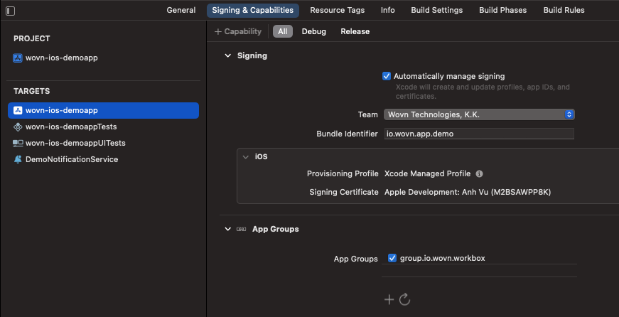

# WOVN プッシュ通知機能 (v3.5.0 以上) (自動翻訳)

このドキュメントは、アプリがすでに Apple Push Notification service (APNs) または Firebase からプッシュ通知を受信できることを前提としています。

## 概要

このドキュメントでは、以下のことを学びます：

1. WOVN が通知をどのように翻訳できるか
2. エンドユーザーに表示する前にサーバーからの通知データにアクセスし、翻訳するために WOVN に許可する方法
3. 機密ユーザー情報を含む通知データを翻訳するために WOVN を使用する方法
4. ローカルプッシュ通知を翻訳するために WOVN を使用する方法

## 詳細

### 1. WOVN が通知をどのように翻訳できるか


1. まず、テストデバイスにテストプッシュ通知を送信します。これにより、WOVN が通知データを WOVN ダッシュボードに報告し、翻訳できるようになります。
2. WOVN ダッシュボードが通知データを翻訳した後、同じ通知を再度テストデバイスに送信して確認します。
3. 通知が翻訳されたことを確認したら、すべてのユーザーに送信できます。

### 2. エンドユーザーに表示する前にサーバーからの通知データにアクセスし、翻訳するために WOVN に許可する方法

1. サーバー側で、すべてのプッシュ通知に `"mutable_content": true` を追加してください。これがないと、Apple は通知をさらに編集する必要がないと判断し、通知をそのまま表示します。
2. `UNNotificationServiceExtension` を拡張してカスタムロジックを追加していない場合は、Apple のドキュメントに従って追加してください: https://developer.apple.com/documentation/usernotifications/unnotificationserviceextension
3. `UNNotificationServiceExtension` とアプリは別々のサンドボックスで実行されるため、データを共有するためのブリッジを作成する必要があります。これには App Groups を使用します：
    - メインアプリの `App Groups` に `group.io.wovn.workbox` を追加します。この例では `wovn-ios-demoapp` です。 
    - Notification Service Extension の `App Groups` に `group.io.wovn.workbox` を追加します。 
4. メインアプリと `UNNotificationServiceExtension` の両方で `Wovn SDK` に App Groups `group.io.wovn.workbox` を通知します。その後、プッシュ通知を翻訳します。
    - `AppDelegate.swift` で、`Wovn.start` のコードパラメータ `appGroupIdentifier` を `"group.io.wovn.workbox"` に、`isNotificationServiceEnv` を `false` に変更します。例：`Wovn.start(appGroupIdentifier: "group.io.wovn.workbox", isNotificationServiceEnv: false)`

    ```swift
    func application(_ application: UIApplication, didFinishLaunchingWithOptions launchOptions: [UIApplication.LaunchOptionsKey: Any]?) -> Bool {
        // 一部のアプリケーションコード
        
        // [変更前]
        // Wovn.start(isDebugMode: _isDebugAssertConfiguration(), autoTranslateUIKit: true)

        // [変更後]
        Wovn.start(
            appGroupIdentifier: "group.io.wovn.workbox",
            isDebugMode: _isDebugAssertConfiguration(),
            autoTranslateUIKit: true,
            isNotificationServiceEnv: false
        )
        // 一部の WOVN コード
        // その他のアプリケーションコード
    }
    ```

    - `UNNotificationServiceExtension` フォルダ内の `NotificationService.swift` に以下のコードを追加します。

    ```swift
    import UserNotifications
    import WOVNswift

    class NotificationService: UNNotificationServiceExtension {

        var contentHandler: ((UNNotificationContent) -> Void)?
        var bestAttemptContent: UNMutableNotificationContent?

        override func didReceive(_ request: UNNotificationRequest, withContentHandler contentHandler: @escaping (UNNotificationContent) -> Void) {
            Wovn.start(appGroupIdentifier: "group.io.wovn.workbox", isNotificationServiceEnv: true)
            self.contentHandler = contentHandler
            bestAttemptContent = (request.content.mutableCopy() as? UNMutableNotificationContent)
            if let bestAttemptContent = bestAttemptContent {
                let translatedContent = Wovn.translateNotificationContent(notiContent: bestAttemptContent)
                contentHandler(translatedContent)
            }
        }
        
        override func serviceExtensionTimeWillExpire() {
            // システムによって拡張機能が終了される直前に呼ばれます。
            // これを機会に「最善の試み」として修正されたコンテンツを配信します。そうしないと、元のプッシュペイロードが使用されます。
            if let contentHandler = contentHandler, let bestAttemptContent = bestAttemptContent {
                contentHandler(bestAttemptContent)
            }
        }
    }
    ```

5. ステップ4の後、プッシュ通知の内容は翻訳され、`translatedContent` に保存されます。上記のコードでは、そのまま表示していますが、エンドユーザーに表示する前にさらにカスタマイズすることも可能です。

### テスト方法

1. 以下のデータを使用して、Firebase Cloud Messaging 経由でデバイスにプッシュ通知を送信できます。

    ```json
    {
        "to": "{YOUR TESTING DEVICE FCM TOKEN}",
        "notification": {
            "mutable_content": true, // この行を忘れずに
            "title": "こんにちは",
            "body": "素晴らしい日ですね！"
        }
    }
    ```

2. 初回は、テストデバイスが日本語で通知を受信するはずです。これは、WOVN がまだ翻訳を持っていないためです。WOVN にデータの報告を許可している場合、通知のタイトルと本文を WOVN ダッシュボードの PushNotification 画面内で確認できます。
    - 
    - 
3. 2つの値を翻訳した後、`Save and publish` をクリックすると、次回から同じ通知を送信した際にエンドユーザーの言語に翻訳されて表示されます。
    - 

## 3. 機密ユーザー情報を含む通知データを翻訳するために WOVN を使用する方法

1. 通知の `title` や `body` にユーザーデータを直接追加する代わりに、`%{variable_name}%` を使用し、通知データの `data` 内にデータを含めることができます。

    ```json
    {   
        "to": "{YOUR TESTING DEVICE FCM TOKEN}",
        "notification": {
            "mutable_content": true, // この行を忘れずに
            "title": "今月の請求書の準備ができました, %name%さん!",
            "body": "今月は%amount%円です。 %date%までにお支払いください"
        },
        "data": {
            "name": "John Doe",
            "amount": "10000",
            "date": "2023/12/12"
        }  
    }
    ```

2. 通常のプッシュ通知をテストする際と同じプロセスに従ってください。ユーザー機密データを含む通知も情報漏洩なく翻訳されます。
    - 
    - 

## 4. ローカルプッシュ通知を翻訳するために WOVN を使用する方法

`Wovn.translateNotificationData` を使用して、ローカルプッシュ通知のデータを表示前に翻訳できます。

```swift
var content = UNMutableNotificationContent()
content.title = "こんにちは%name%さん"
content.subtitle = "お金を払ってください.%amount%ドルです"
content.body = "期限内にお支払いをお願いいたします。%amount%ドルです"
content.userInfo.updateValue("John Doe", forKey: "name")
content.userInfo.updateValue("150", forKey: "amount")
content.userInfo.updateValue("2099/12/12", forKey: "date")
content.sound = UNNotificationSound.default
content = Wovn.translateNotificationContent(notiContent: content)
// ローカルプッシュ通知を表示するコード
```
