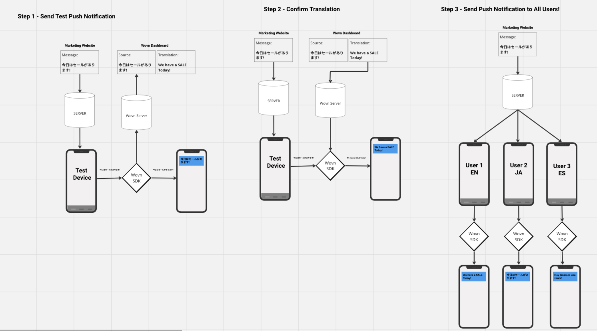
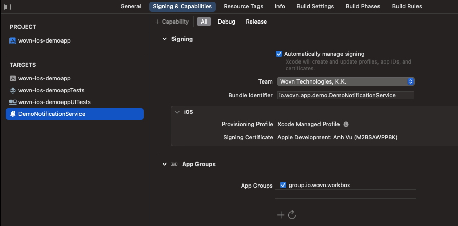
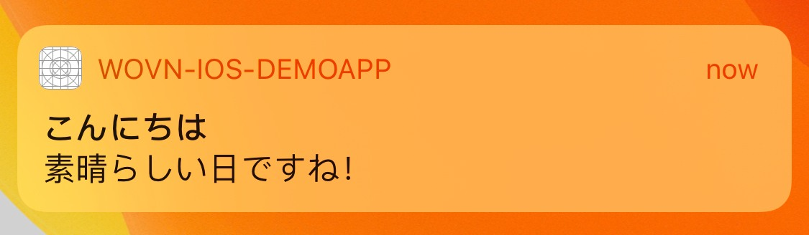

# Wovnプッシュ通知機能（v3.4.1以前）

このドキュメントは、アプリが既にApple Push Notification service（APNs）またはFirebaseからプッシュ通知を受信できることを前提としています。

## 概要

このドキュメントでは以下の内容を学びます：

1. Wovnが通知を翻訳する仕組み
2. サーバーからの通知データにWovnがアクセスして翻訳し、エンドユーザーに表示するための設定方法
3. 機密ユーザー情報を含む通知データをWovnで翻訳する方法
4. ローカルプッシュ通知をWovnで翻訳する方法

## 詳細

### 1. Wovnが通知を翻訳する仕組み



1. まずテストデバイスにテストプッシュ通知を送信します。これによりWovnが通知データをダッシュボードに報告し、翻訳できるようになります。
2. Wovnダッシュボードで通知データが翻訳された後、同じ通知を再度テストデバイスに送信して確認します。
3. 通知が翻訳されていることを確認後、全ユーザーに送信可能です。

### 2. サーバーからの通知データ翻訳設定手順

1. サーバー側で全てのプッシュ通知に`"mutable_content": true`を追加（必須）。これがないとAppleは通知が編集不要と判断し、修正を許可せずに表示します。
2. UNNotificationServiceExtensionを拡張していない場合は、Apple公式ドキュメントに従って実装：
   https://developer.apple.com/documentation/usernotifications/unnotificationserviceextension
3. UNNotificationServiceExtensionとアプリ間のデータ共有のためにApp Groupsを使用：
   - メインアプリのApp Groupsに`group.io.wovn.workbox`を追加（図参照）
   
   - Notification Service ExtensionのApp Groupsにも同グループを追加（図参照）
   
4. Wovn SDKにApp Groupsを通知：
   - AppDelegate.swiftで`Wovn.eventTypeReport`呼び出し前に設定追加：

   ```swift
   func application(_ application: UIApplication, didFinishLaunchingWithOptions launchOptions: [UIApplication.LaunchOptionsKey: Any]?) -> Bool {
       // アプリケーションコード
       
       // [変更前]
       // Wovn.eventTypeReport(_isDebugAssertConfiguration())

       // [変更後]
       Wovn.setAppGroupIdentifier("group.io.wovn.workbox")
       Wovn.eventTypeReport(_isDebugAssertConfiguration())
       // Wovn関連コード
       // その他のアプリケーションコード
   }
   ```

   - NotificationService.swiftに以下を追加：

   ```swift
   import UserNotifications
   import WOVNswift

   class NotificationService: UNNotificationServiceExtension {

       var contentHandler: ((UNNotificationContent) -> Void)?
       var bestAttemptContent: UNMutableNotificationContent?

       override func didReceive(_ request: UNNotificationRequest, withContentHandler contentHandler: @escaping (UNNotificationContent) -> Void) {
           Wovn.setAppGroupIdentifier("group.io.wovn.workbox", isMainApp: false)
           self.contentHandler = contentHandler
           bestAttemptContent = (request.content.mutableCopy() as? UNMutableNotificationContent)
           if let bestAttemptContent = bestAttemptContent {
               let translatedContent = Wovn.translateNotificationContent(notiContent: bestAttemptContent)
               contentHandler(translatedContent)
           }
       }
       
       override func serviceExtensionTimeWillExpire() {
           if let contentHandler = contentHandler, let bestAttemptContent = bestAttemptContent {
               contentHandler(bestAttemptContent)
           }
       }
   }
   ```

5. 上記設定後、翻訳された通知内容を表示可能。必要に応じて表示前のカスタマイズが可能。

### 機能テスト手順

1. Firebase Cloud Messaging経由でテスト通知送信：

   ```json
   {
       "to": "{テストデバイスのFCMトークン}",
       "notification": {
           "mutable_content": true, // 必須
           "title": "こんにちは",
           "body": "素晴らしい日ですね！"
       }
   }
   ```

2. 初回通知は日本語で表示（翻訳未登録状態）。WovnダッシュボードのPushNotification画面に通知データが登録されます：
   
   
3. 翻訳後「保存して公開」を実行すると、次回通知から翻訳が適用：
   

## 3. 機密情報を含む通知の翻訳方法

1. ユーザーデータを直接通知本文に埋め込まず、`%{変数名}%`プレースホルダーを使用：

   ```json
   {   
       "to": "{テストデバイスのFCMトークン}",
       "notification": {
           "mutable_content": true,
           "title": "今月の請求書の準備ができました, %name%さん!",
           "body": "今月は%amount%円です。 %date%までにお支払いください"
       },
       "data": {
           "name": "John Doe",
           "amount": "10000",
           "date": "2023/12/12"
       }  
   }
   ```

2. 通常通知と同じテスト手順で翻訳可能（機密情報漏洩防止）：
   
   

## 4. ローカルプッシュ通知の翻訳方法

`Wovn.translateNotificationData`を使用してローカル通知を翻訳：

```swift
var content = UNMutableNotificationContent()
content.title = "こんにちは%name%さん"
content.subtitle = "お金を払ってください.%amount%ドルです"
content.body = "期限内にお支払いをお願いいたします。%amount%ドルです"
content.userInfo.updateValue("Jone Doe", forKey: "name")
content.userInfo.updateValue("150", forKey: "amount")
content.userInfo.updateValue("2099/12/12", forKey: "date")
content.sound = UNNotificationSound.default
content = Wovn.translateNotificationContent(notiContent: content)
// ローカル通知表示コード
```
